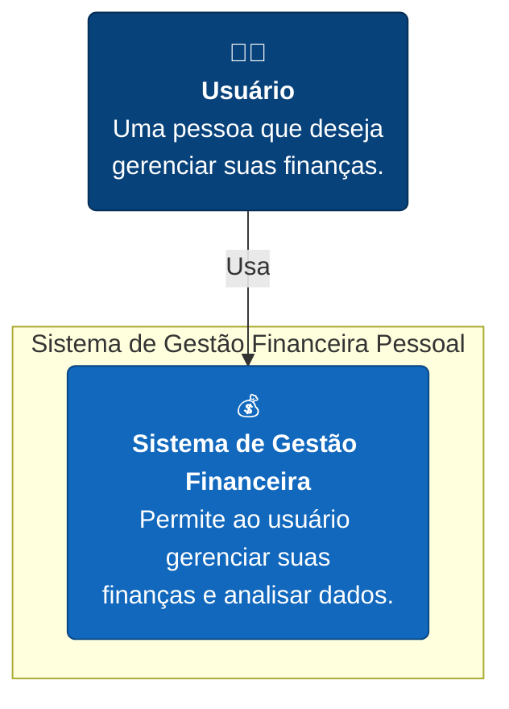
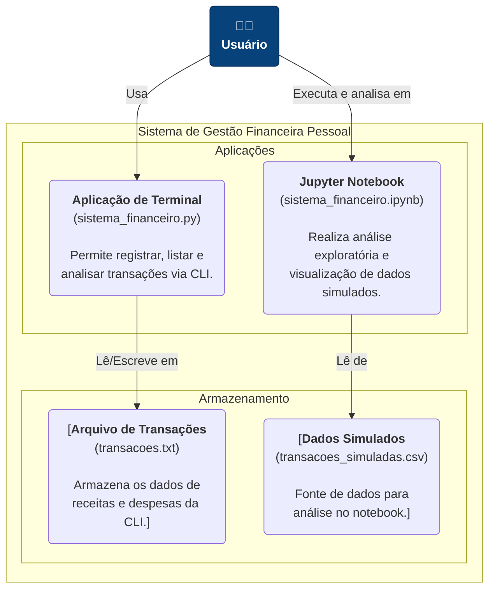
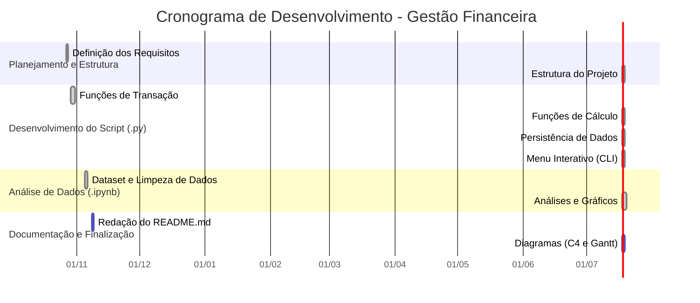

# 💰 Sistema de Gestão Financeira Pessoal com Análise de Dados

**Disciplina:** Programação para Ciência de Dados  
**Curso:** MBA em Ciência de Dados – UNIFOR  
**Instrutor:** Cássio Pinheiro  
**Integrante:** Matheus Sales (2528052)  
**Data de Entrega:** 14/11/2025

---

## 🎯 Objetivo do Projeto

Este projeto tem como objetivo desenvolver um sistema de gestão financeira pessoal em Python. O sistema permite o registro e acompanhamento de transações financeiras (receitas e despesas) e oferece ferramentas para análise de dados e visualização de resultados.

O projeto está dividido em duas partes principais:
1.  **Aplicação Interativa (Terminal):** Um script (`sistema_financeiro.py`) que oferece um menu para gerenciar finanças pessoais diretamente no terminal.
2.  **Análise de Dados (Jupyter Notebook):** Um notebook (`sistema_financeiro.ipynb`) que utiliza dados simulados para realizar análises exploratórias e gerar gráficos com as bibliotecas `pandas` e `matplotlib`.

---

## ✨ Funcionalidades

### Aplicação de Terminal (`sistema_financeiro.py`)

- **Adicionar Transações:** Registre receitas e despesas de forma simples.
- **Categorizar Despesas:** Atribua categorias às suas despesas (ex: "Alimentação", "Transporte").
- **Listar Transações:** Visualize todas as transações ou filtre por tipo (receita/despesa) e categoria.
- **Exibir Extrato:** Gere um extrato formatado com todas as movimentações.
- **Gerar Relatório Financeiro:** Obtenha um resumo completo com:
  - Total de receitas e despesas.
  - Saldo atual.
  - Gastos detalhados por categoria.
- **Persistência de Dados:** Salve suas transações em um arquivo (`transacoes.txt`) para que os dados não sejam perdidos ao fechar o sistema.

### Análise de Dados (`sistema_financeiro.ipynb`)

O notebook utiliza um conjunto de dados simulado (`dados/transacoes_simuladas.csv`) para demonstrar a aplicação de técnicas de análise de dados:

- **Carregamento e Limpeza de Dados:** Leitura de dados de um arquivo CSV e tratamento de colunas (datas, tipos, etc.).
- **Análises Geradas:**
  - Cálculo do saldo mensal (receitas vs. despesas).
  - Agregação de gastos por categoria.
- **Visualizações (Gráficos):**
  - **Receitas vs. Despesas:** Gráfico de barras comparando o total de entradas e saídas.
  - **Gastos por Categoria:** Gráfico de barras horizontais para visualizar a distribuição dos gastos.
  - **Evolução do Saldo Mensal:** Gráfico de linhas que mostra a variação do saldo ao longo do tempo.

---

## 📊 Arquitetura e Planejamento

Para ilustrar a arquitetura e o planejamento do projeto, foram criados os seguintes diagramas.

### Nível 1: Diagrama de Contexto (C4)

O diagrama de contexto mostra a interação de alto nível entre o usuário e o sistema de gestão financeira.



### Nível 2: Diagrama de Contêineres (C4)

Este diagrama detalha os principais "contêineres" (aplicações e armazenamentos de dados) que compõem o sistema.



### Desenvolvimento do Projeto (Gantt Chart)

O cronograma abaixo ilustra as principais etapas do desenvolvimento do projeto.



---

## 🛠️ Tecnologias Utilizadas

- **Linguagem:** Python 3
- **Bibliotecas (para o Notebook):**
  - `pandas`: Para manipulação e análise de dados.
  - `matplotlib`: Para a criação de gráficos e visualizações.
- **Ambiente:** O projeto pode ser executado em um ambiente virtual Python (`venv`) para gerenciar dependências.

---

## 🚀 Como Executar

### 1. Pré-requisitos

- Ter o Python 3 instalado.
- (Opcional, mas recomendado) Criar e ativar um ambiente virtual:
  ```bash
  python3 -m venv venv
  source venv/bin/activate  # No macOS/Linux
  # venv\Scripts\activate  # No Windows
  ```
- Instalar as dependências para o notebook:
  ```bash
  pip install pandas matplotlib
  ```

### 2. Executando a Aplicação de Terminal

Para iniciar o sistema de gestão financeira, execute o seguinte comando no terminal:

```bash
python sistema_financeiro.py
```

Você verá um menu interativo para utilizar as funcionalidades do sistema.

### 3. Executando o Notebook de Análise

Para explorar a análise de dados, você precisará do Jupyter Notebook ou JupyterLab:

1.  Instale o Jupyter (caso não tenha):
    ```bash
    pip install notebook
    ```
2.  Inicie o Jupyter:
    ```bash
    jupyter notebook
    ```
3.  No seu navegador, abra o arquivo `sistema_financeiro.ipynb`.

**Observação:** O notebook utiliza um arquivo `dados/transacoes_simuladas.csv`. Certifique-se de que este arquivo exista no diretório `dados` para executar a análise.

---

## 📂 Estrutura do Projeto

```
/projeto_01_gestao_financeira_pessoal
├── dados/
│   └── transacoes.txt          # Arquivo de dados da aplicação de terminal
├── relatorios/
│   └── .gitkeep                # Pasta para futuros relatórios
├── .gitignore                  # Arquivos a serem ignorados pelo Git
├── README.md                   # Documentação do projeto
├── requirements.txt            # Lista de dependências
├── sistema_financeiro.py       # Script principal da aplicação de terminal
└── sistema_financeiro.ipynb    # Notebook para análise de dados
```

---

## 📈 Conclusão

Este projeto integra conceitos de programação estruturada com análise de dados. O script `.py` oferece uma ferramenta prática e funcional para gestão financeira, enquanto o notebook `.ipynb` demonstra como analisar e extrair insights de dados financeiros usando `pandas` e `matplotlib`. O trabalho reflete a aplicação dos fundamentos aprendidos na disciplina, com foco em modularidade, manipulação de dados e clareza de código.