# 💰 Sistema de Gestão Financeira Pessoal

**Disciplina:** Programação para Ciência de Dados
**Curso:** MBA Ciência de Dados - UNIFOR
**Instrutor:** Cássio Pinheiro
**Integrantes:**
- Matheus Sales (2528052)
**Repositório GitHub:** [https://github.com/MatheusFeSales/projeto_01_gestao_financeira_pessoal](https://github.com/MatheusFeSales/projeto_01_gestao_financeira_pessoal)
**Data de Entrega:** 14/11/2025

---

## 2. Objetivo do Projeto

O objetivo deste projeto é desenvolver um sistema de gestão financeira pessoal em Python, que permita ao usuário registrar, acompanhar e analisar suas transações financeiras (receitas e despesas). O sistema visa resolver o problema da falta de controle financeiro, oferecendo uma ferramenta simples e eficaz para qualquer pessoa que deseje organizar suas finanças.

---

## 3. Diagrama de Contexto (Mermaid)

O diagrama C4 de contexto abaixo mostra o sistema e seus relacionamentos de alto nível.

```mermaid
graph TD
    subgraph "Sistema de Gestão Financeira Pessoal"
        direction LR
        style System fill:#1168bd,stroke:#0b4884,color:#fff

        System("💰<br><b>Sistema de Gestão Financeira</b><br>Permite ao usuário gerenciar suas<br>finanças e analisar dados.")
    end

    Actor("🧑‍💻<br><b>Usuário</b><br>Uma pessoa que deseja<br>gerenciar suas finanças.")

    Actor -->|"Usa"| System

    style Actor fill:#08427b,stroke:#052e56,color:#fff
```



---

## 4. Funcionalidades Implementadas

- **Adicionar Transações:** Permite registrar receitas e despesas.
- **Categorizar Despesas:** Atribui categorias às despesas para melhor organização.
- **Listar Transações:** Exibe todas as transações, com filtros por tipo (receita/despesa) e categoria.
- **Exibir Extrato:** Mostra um extrato completo e formatado de todas as movimentações.
- **Gerar Relatório Financeiro:** Cria um resumo com totais de receitas, despesas, saldo e gastos por categoria.
- **Persistência de Dados:** Salva e carrega as transações de um arquivo de texto (`transacoes.txt`).

---

## 5. Estrutura de Dados

- **Modelo de Dados:** As transações são armazenadas em uma lista de dicionários em memória.
- **Exemplo de Estrutura de Entrada (Dicionário de Transação):**
  ```python
  {
      'tipo': 'despesa',
      'descricao': 'Almoço',
      'valor': 35.50,
      'data': '2025-11-14',
      'categoria': 'Alimentação'
  }
  ```
- **Formato do Arquivo de Dados (`transacoes.txt`):** Arquivo de texto simples (TXT), onde cada linha representa uma transação com campos separados por `|`.
  ```
  tipo|descricao|valor|data|categoria
  ```

---

## 6. Requisitos Técnicos

- **Versão do Python:** Python 3.x
- **Bibliotecas e Dependências:**
  - `pandas>=2.0.0`
  - `matplotlib>=3.7.0`
  - `jupyter>=1.0.0`
- **Como Instalar as Dependências:**
  ```bash
  pip install -r requirements.txt
  ```

---

## 7. Como Executar o Projeto

1.  **Instalação:**
    - Clone o repositório.
    - (Opcional) Crie e ative um ambiente virtual:
      ```bash
      python3 -m venv venv
      source venv/bin/activate
      ```
    - Instale as dependências:
      ```bash
      pip install -r requirements.txt
      ```
2.  **Execução:**
    - Para executar o sistema principal no terminal:
      ```bash
      python sistema_financeiro.py
      ```
    - Para visualizar a análise de dados, inicie o Jupyter e abra o notebook `sistema_financeiro.ipynb`:
      ```bash
      jupyter notebook
      ```

---

## 8. Análises Realizadas

No notebook `sistema_financeiro.ipynb`, são realizadas as seguintes análises com dados simulados:
- Cálculo do saldo mensal.
- Agregação de gastos por categoria.
- **Visualizações:**
  - Gráfico de barras comparando receitas e despesas.
  - Gráfico de barras horizontais mostrando a distribuição de gastos por categoria.
  - Gráfico de linhas para a evolução do saldo mensal.

---

## 9. Estrutura do Projeto

```
/projeto_01_gestao_financeira_pessoal/
├── README.md
├── requirements.txt
├── sistema_financeiro.py       # Arquivo principal
├── dados/
│   └── transacoes.txt
├── relatorios/
│   └── .gitkeep
└── sistema_financeiro.ipynb    # Notebook de análise
```

---

## 10. Capturas de Tela / Exemplos de Saída

#### Gráfico 1: Menu Interativo do Programa

*Menu interativo ao rodar o programa no terminal*

#### Gráfico 2: Receitas vs Despesas

*Comparação total entre receitas (azul) e despesas (vermelho)*

#### Gráfico 3: Gastos por Categoria

*Distribuição dos gastos em cada categoria*

#### Gráfico 4: Evolução do Saldo Mensal

*Linha do tempo mostrando a evolução do saldo*

---

## 11. Testes Realizados

- **Cenários Testados:**
  - Adição de receitas e despesas com dados válidos e inválidos.
  - Listagem com e sem filtros.
  - Geração de relatório e extrato.
  - Salvamento e carregamento de dados.
- **Validações Implementadas:**
  - Validação de tipo de transação, valor, data e descrição.

---

## 12. Referências e Bibliografia

- Documentação oficial do Python.
- Documentação das bibliotecas `pandas` e `matplotlib`.

---

## 13. Contribuições dos Integrantes

- **Matheus Sales:** Responsável por todo o desenvolvimento do projeto, incluindo o script principal, o notebook de análise e a documentação.

---

## 14. Próximos Passos / Melhorias Futuras

- Adicionar uma interface gráfica (GUI) com Tkinter ou PyQT.
- Criar mais visualizações de dados.
- Implementar um sistema de metas financeiras.
- Usar um banco de dados (como SQLite) para persistência.